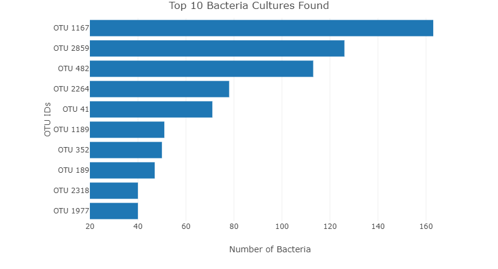
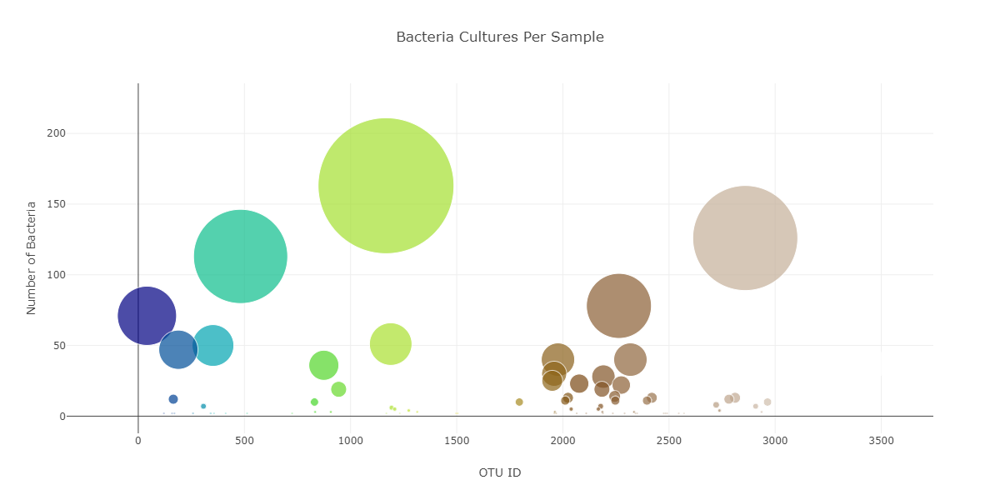
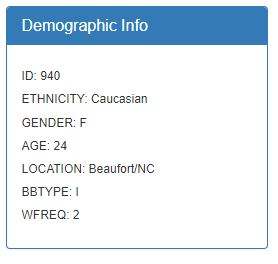

# Module 14: Belly Button Challenge
## Table of Contents
- [Introduction](#Introduction)
- [Tools](#Tools)
- [Key Steps](#key-steps)

## Introduction
In this assignment, you will build an interactive dashboard to explore the Belly Button Biodiversity datasetLinks to an external site., which catalogs the microbes that colonize human navels.

## Tools
1. Javascript
2. D3
3. HTML
4. Plotly

## Key Steps
1. JSON Data

-Use the D3 library to read in samples.json from the URL https://static.bc-edx.com/data/dl-1-2/m14/lms/starter/samples.json
function buildMetadata(sample) {
  d3.json("https://static.bc-edx.com/data/dl-1-2/m14/lms/starter/samples.json").then((data) => {

    // Get the metadata field
    const metadata = data.metadata;
    console.log(metadata)

    // Filter the metadata for the object with the desired sample number
    const sampleMetadata = metadata.filter(obj => obj.id === +sample)[0];
    console.log(sampleMetadata)

    // Check if sampleMetadata is defined
    if (sampleMetadata) {
    // Use d3 to select the panel with id of `#sample-metadata`
    const panel = d3.select("#sample-metadata");
    console.log(panel)

2. Populated Dropdown
The dropdown menu had options for 153 IDS from individuals in the sample data.

-function init() {
  d3.json("https://static.bc-edx.com/data/dl-1-2/m14/lms/starter/samples.json").then((data) => {
    // Get the names field
    const names = data.names;
    console.log(names)

    // Use d3 to select the dropdown with id of `#selDataset`
    const dropdown = d3.select("#selDataset");
    console.log(dropdown)

    // Use the list of sample names to populate the select options
    // Hint: Inside a loop, you will need to use d3 to append a new
    // option for each sample name.
    names.forEach(name => {
      dropdown.append("option")
        .text(name)  // Set the text for the dropdown option
        .property("value", name);  // Set the value for the option
    });

3. Bar Chart
Create a horizontal bar chart with a dropdown menu to display the top 10 OTUs found in that individual.

4. Bubble Chart
Create a bubble chart that displays each sample

5. Metadata
Showed demographic data for each selected individual, displayed as key:value pairs.

